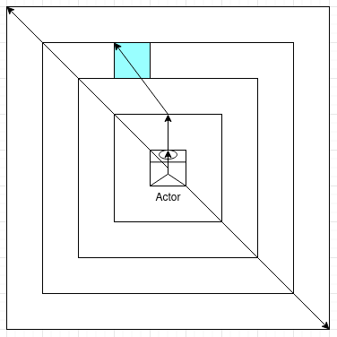
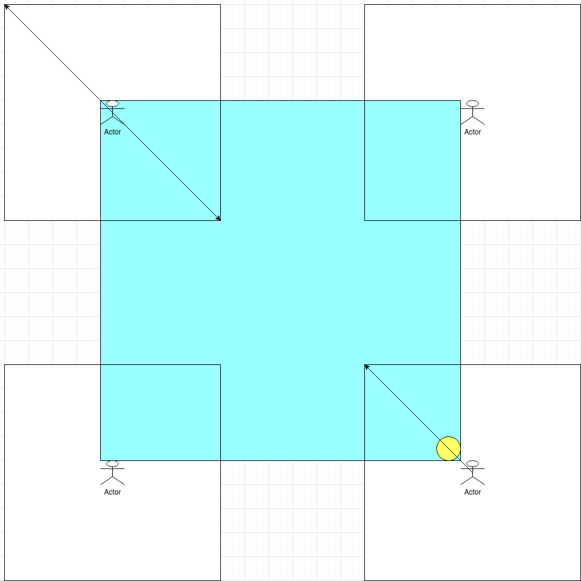

# Report Lab 1 SEC

## Author

```
Alban Favre
```

### Design

To clearly understand the game logic some things need to be explained

#### Distance



All concentric square represent a distance zone: every position in the same distance have the same distance.

The actor is in the 0 distance zone, then there is the 1 distance zone, then 2, then 3 where the blue square is located, and finally the 4 distance zone, which is the furthest the actor can go in one move with default parameters.

A weird characteristic of this distance definition, is that going in a diagonal corresponds to 2 orthogonal distances, but is still considered 1 distance, as we can reach it in one distance, this is why the path to the blue square feels incorrect, it is reachable in three distance, therefore is three distance (two up one diagonal).

#### The board is a torus




The first bonus and the most complex, is that the board is a torus.

The important thing is that the actor is in the upper left, from there it can reach **all** possible position in it's max distance square. 

This has several consequences:

- positions out of bound can be reached, if such a position is entered, a special message will ask if you if want to change your destination, or to proceed to the modulated position on the board that corresponds to the out of bound position you have given (you will always be on the board, you can just enter out of bound positions that will be corrected.)
  - negative number cannot be entered ever, as the normal move system is based only on positive integers, even if the internal logic works with signed integer.
- The shortest distance to the treasure is also affected, in this example, the treasure is at 1 distance from the actor.
- It was way harder to code and added a lot of corner cases, but it was fun anyway.

#### Zmoves

The normal move described in the lab document doesn't feel right. This normal move is known as `move` in the game, but  `teleport` in the code, that is because it's not a move at all, it's a teleportation to a specified destination.

Zmoves are there to make movement more zuper.

A zmove is defined by a direction and a speed: (both will always be positive)

- The directions are the 8 traditional direction on a compass, but with stupid names (like `UpRight`), I realized now I should have named them like `NorthEast`.

  - You can easily enter a direction with it's corresponding digit on a num pad (it's recommended that you use your num pad)

```numpad
7 8 9
4   6
1 3 2
```
- The speed corresponds to the distance the user wants to go
  - it cannot be 0 (you can't move if you have no speed).
  - it cannot be higher than the max distance.
  - it cannot be negative, enter the opposite direction instead.

Due to the way the zmoves work, you cannot reach some position you could reach with normal moves, for example the blue square int the first image is unreacheable for the actor in only one zmove. This is not a problem as normal moves can still be entered

To streamline even more the movement process, you can enter a zmove directly in the choose your action screen

**Note:** This characteristic only applies for zmove, you can only enter a normal move in the normal move screen. 

#### Difficulty levels

Due to additional possible customization in the game, for player color and player tile, it is possible to render the game harder. As the trackers use the player color to mark the board, if the player color is blue, the tracker is rendered useless. Additionally, if the player chooses the same tile as the water tile, the game also becomes harder. This is mentioned in the game itself.

#### Number pair format

Both zmove and normal moves use a 2 integer separated with a comma format, there are three type of accepted pair format: (of course hex and dec are accepted)

- `(2,0x4)`
- `[0x2,0xAF]` note: that would be an invalid zmove, speed is to high
- `3,4` this format is not described in the lab document, but it streamlines the game flow, that is why it's there.

#### Customizable Board Height and Board Width

This will not be implemented, it's possible I didn't erased all traces of this abandoned feature, this will explains some inconsistencies in the code.

